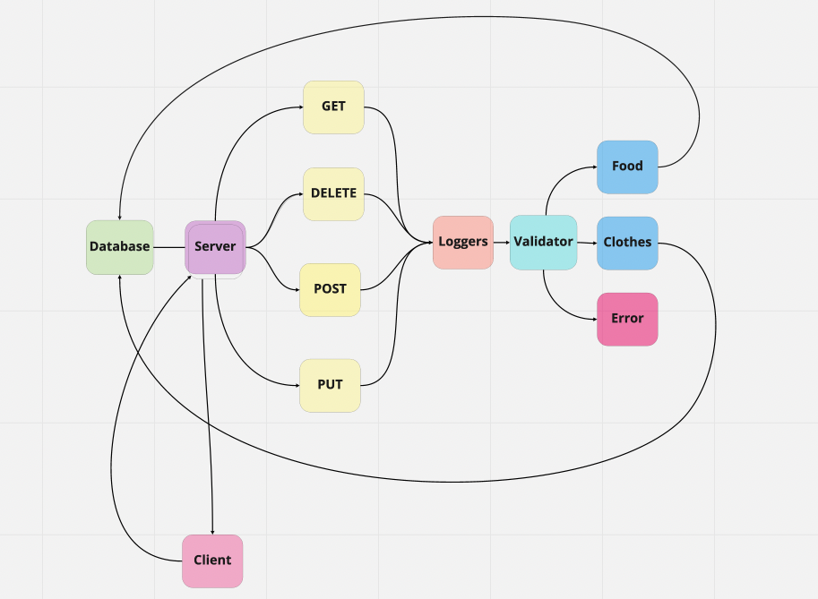

# basic-api-server

## Author

Roop Hayer

## Summary of Problem Domain

Creating a server with database for CRUD app.

## Links to Application Deployment

[Heroku](https://roop-basic-api-server.herokuapp.com/)

[Actions Page](https://github.com/RoopHayer/basic-api-server/actions)

[PR](https://github.com/RoopHayer/basic-api-server/pull/3)

## Include Embedded UML

## Routes

- HTTP GET

  - Path: /food ; /clothes
    - Returns: An array of objects, each object being one entry from the database.

- HTTP GET

  - Path: /food/1 ; /clothes/1
    - Returns: The object from the database, which has the id matching that which is in the path.

- HTTP POST

  - Path: /food ; /clothes
    - Returns: The record that was added to the database.

- HTTP PUT

  - Path: /food ; /clothes
    - Returns: The object from the database, which has the id matching that which is in the path, with the updated/changed data.

- HTTP DELETE
  - Path: /food/1 ; /clothes/1
    - Returns: The record from the database as it exists after deleting it.